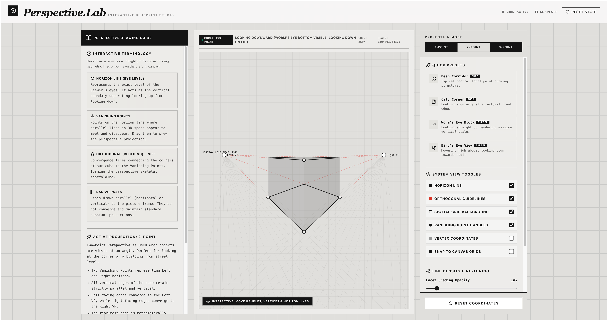

# Perspective Visualizer

[Demo](https://perspective-visualizer.pages.dev/) • [Google AI Studio](https://ai.studio/apps/30339ec3-657e-4e89-8f0c-41a92b517099/)

An interactive, raw-minimalist web application for visualizing 1-point, 2-point, and 3-point perspective rendering of a 3D cube model. Designed with a clean, high-contrast digital blueprint aesthetic, this tool serves as an interactive playground for artists, industrial draftspersons, and architecture students.

## Key Features

*   **Diverse Projection Systems**: Easily pivot between **1-Point** (focal corridor), **2-Point** (angular corner), and **3-Point** (Zenith/Nadir aerial view) perspective rules.
*   **Fully Draggable Coordinates**: Direct-manipulation graphics allow dragging vanishing points, key vertices, depth guides, and active horizon lines with instant real-time projection updates.
*   **Interactive Glossary Guidelines**: Hovering over terminology highlights key visual lines on the canvas to learn the relationship between eye level, orthogonals, and transversals dynamically.
*   **Precision View Toggles**: Adjust guideline opacities, turn on/off the physical coordinate displays, adjust 3D facet shading, or toggle snap-to-grid controls for flawless alignment.
*   **Built-in Architecture Presets**: Swiftly preview classic structures including the *Deep Corridor*, *City Corner*, and *Sky High Worm's Eye view*.

## Built with

*   **React + TypeScript** (State engine and layout architecture)
*   **Tailwind CSS** (Clean, raw, concrete-colored drafting board motif)
*   **HTML5 Canvas API** (Dynamic, sub-pixel accurate line rendering and interactive vector math)
*   **Lucide React** (Minimalist UI icons)

## Google AI Studio Remix

If you prefer to work with Google AI Studio (which this project is built with), you may use the following link: https://ai.studio/apps/30339ec3-657e-4e89-8f0c-41a92b517099

One-shot: *Help me create a web app that help me visualize one point, two point and three point perspective, by having the user drag around the points to see the generated cube*

## Run Locally

**Prerequisites:**  Node.js

1. Install dependencies:
   `npm install`
3. Run the app:
   `npm run dev`

## License

[The Unlicense](https://spdx.org/licenses/Unlicense.html)
